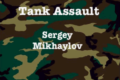
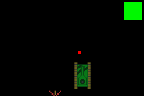

Pressing the enter key on a keyboard while in the the title screen state will begin the gameplay loop. Using the directional buttons the tank is moved around the screen. The goal is to avoid hitting the oncoming mines. Shooting them will
cause them to disapear. 
You have three lives, shown by the colored square in the upper right corner. It starts off green,
hitting a mine once will make it yellow, hitting another will make it red. The next collision will
end the game and display your score = number of mines avoided.
The trick for this running smoothly is using DMA to quickly draw repeating assets instead of wasting processor power drawing pixels individually.

The game can be played by:
First: Downloading the TankAssault.gba rom image from this repo.

Second: Downloading any opensource GameBoy Advanced emulator.

Third: Just load the TankAssault.gba rom into your emulator and enjoy.

OR burn the TankAssault.gba rom onto an actual GBA cartridge and play on a real GBA. You might have to ask Nintendo nicely, in this case.

Here are some screenshots and a gameplay demonstartion.
There is a very choppy gameplay demo video on YouTube: https://www.youtube.com/watch?v=G8EmlH17Bww>

The Title Screen

A gameplay screenshot, taken through a GBA emulator.

